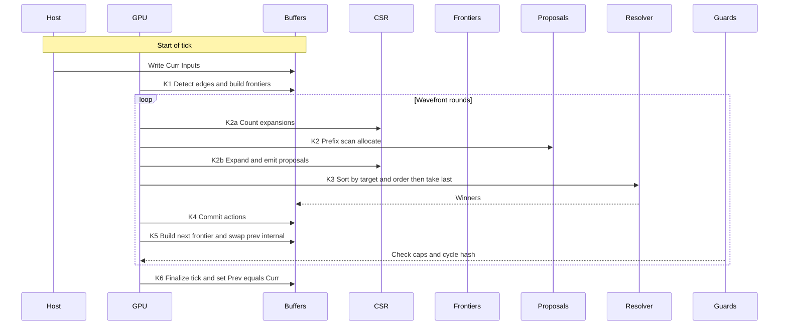

# **Mycos Technical Specification**

## 1. Overview

**Mycos** is an evolving mesh intelligence system built from interconnected **network chunks**.
A **network chunk** is a self-contained processing unit consisting of:

* **A data block** of bits, partitioned into **Inputs**, **Outputs**, and **Internals**.
* **Connections** linking specific bits, with trigger conditions and actions.

Chunks can be linked together to form larger systems, either via **flat output→input links** or **optional gated nesting**.

All processing occurs using a **GPU-first synchronous wavefront** algorithm to maximize throughput while maintaining deterministic semantics and loop safety.

---

## 2. Network Chunk Specification

### 2.1 Chunk Components

* **Inputs** – bits where external data enters the chunk.
* **Outputs** – bits representing processed results, used to drive actions or link to other chunks.
* **Internals** – bits used for arbitrary state or intermediate processing.

### 2.2 Allowed Connection Types

* **Input → Internal**
* **Internal → Internal**
* **Internal → Output**

Connections outside these forms are invalid.

### 2.3 Connection Triggers

A connection activates when its `from` bit changes state according to:

* **On** – triggers when `from` flips to `1`
* **Off** – triggers when `from` flips to `0`
* **Toggle** – triggers when `from` flips in either direction

### 2.4 Connection Actions

When triggered, the connection modifies the `to` bit:

* **Enable** – set `to = 1`
* **Disable** – set `to = 0`
* **Toggle** – invert `to`

---

## 3. Binary Layout (v1)

All integers little-endian. Bits are LSB-first within bytes.

### 3.1 Header

```
Offset  Size  Field
0x00    8     Magic = "MYCOSCH0" (0x4D 59 43 4F 53 43 48 30)
0x08    2     Version = 0x0001
0x0A    2     Flags (bitfield; 0 for now)
0x0C    4     InputBits     (Ni)
0x10    4     OutputBits    (No)
0x14    4     InternalBits  (Nn)
0x18    4     ConnectionCount (Nc)
0x1C    4     Reserved (0)
```

### 3.2 Bit Sections (packed)

```
Inputs   – ceil(Ni / 8) bytes
Outputs  – ceil(No / 8) bytes
Internals– ceil(Nn / 8) bytes
```

### 3.3 Connection Table (Nc × 16 bytes)

```
Offset  Size  Field
0x00    1     FromSection (0=Input, 1=Internal)
0x01    1     ToSection   (1=Internal, 2=Output)
0x02    1     Trigger     (0=On, 1=Off, 2=Toggle)
0x03    1     Action      (0=Enable, 1=Disable, 2=Toggle)
0x04    4     FromIndex   (bit index within section)
0x08    4     ToIndex     (bit index within section)
0x0C    4     OrderTag    (monotonic authoring order)
```

### 3.4 Optional Trailer (TLV format)

```
type:u16, len:u16, value:len bytes (4-byte aligned)
Suggested:
0x0001 – UTF-8 chunk name
0x0002 – Authoring note
0x0003 – Build hash
```

---

## 4. Execution Semantics

### 4.1 State Buffers

* `Prev` – last committed state
* `Curr` – current state being computed
  Separate bit arrays for Inputs, Outputs, Internals.

### 4.2 GPU Wavefront Algorithm

All chunks and links are processed as one **global supergraph**.

#### Per Tick:

1. **Inject Inputs** – external system writes Inputs to `Curr`.
2. **Detect Edges**:

   ```
   flips  = Curr ^ Prev
   rises  = flips & Curr
   falls  = flips & Prev
   ```

   Build **frontiers** (`On`, `Off`, `Toggle`) for all sections.
3. **Micro-step Loop**:

   * **Expand**: For each frontier bit, emit **proposals** `(to_bit_global, order_tag, action)` using CSR adjacency for that trigger type.
   * **Resolve**: Sort proposals by `(to_bit_global, order_tag)`, keep last-writer for each `to_bit_global`.
   * **Commit**: Apply actions to `Curr` (word-level bit ops).
   * **Build Next Frontier**: Diff Internals to generate next `On/Off/Toggle` frontiers.
   * Repeat until frontier empty or guard triggers.
4. **Commit Tick**:

   * `Prev = Curr` for Inputs, Internals, Outputs.
   * Outputs are read externally but never enqueue new events.

### 4.3 Determinism Rules

* Global `OrderTag` ensures last-writer-wins consistency.
* Within a micro-step, all sources see the same `Prev`.
* All frontiers are processed in stable order.

---

## 5. Performance-Oriented Data Structures

### 5.1 Bit Packing

* Bits stored in `u32` words for GPU atomic support.
* Masks precomputed for each connection effect.

### 5.2 CSR Layouts

* CSR-by-trigger for adjacency:

  ```
  offs_on[from_bit]   → effects_on[]
  offs_off[from_bit]  → effects_off[]
  offs_tog[from_bit]  → effects_tog[]
  ```

### 5.3 Proposal Buffers

* Two-pass: count → prefix-scan → fill proposals.
* Sorting: radix sort by `(to_bit, order_tag)`.
* Resolution: segmented max-reduce on `order_tag`.

---

## 6. Oscillation Handling

### 6.1 Guards

* **Max Rounds** – stop after `max_rounds` micro-steps (default: 1024).
* **Max Effects** – stop after `max_effects` proposals applied (default: 5e6).
* **Cycle Detection** – store last `R` hashes (default: R=8) of `Curr` internals. If a hash repeats, loop detected.

### 6.2 Policies

* **Freeze Last Stable** – revert to last non-repeating state, stop processing.
* **Clamp Commutative** – resolve oscillating bits with commutative precedence (Disable > Enable > Toggle parity), then stop.
* **Parity Quench** – toggle bits that flipped every round in cycle once, then stop.

---

## 7. Chunk Wiring

### 7.1 Flat Inter-chunk Links (Default)

Links connect **Output(A) → Input(B)**.

**Link Record:**

```
struct MycosLink {
  u32  from_chunk;
  u32  from_out_idx;
  u8   trigger;
  u8   action;
  u16  reserved;
  u32  to_chunk;
  u32  to_in_idx;
  u32  order_tag;
}
```

Processed exactly like intra-chunk connections.

### 7.2 Scheduling Across Chunks

* Global wavefront includes both intra-chunk and inter-chunk proposals.
* All `OrderTag`s share a single global ordering space.

---

## 8. Optional Nested Chunks (Gated Execution)

### 8.1 Purpose

Allows a chunk to contain another chunk that only processes when a **gate bit** is set.

### 8.2 Embed Record

```
struct MycosEmbed {
  u32 parent_chunk;
  u32 child_chunk;
  u32 gate_bit;         // parent internal bit index
  u8  io_mode;          // 0=alias, 1=copy_in_out
  u8  reserved[3];
  u32 map_in_count;
  struct { u32 parent_bit; u32 child_in_bit; } map_in[];
  u32 map_out_count;
  struct { u32 child_out_bit; u32 parent_bit; } map_out[];
}
```

### 8.3 Modes

* **Alias** – mapped bits are the same memory.
* **Copy\_in\_out** – copy Inputs/Outputs between parent and child at gate edges.

### 8.4 GPU Handling

* Expansion kernels check `gate_state` before emitting proposals for gated chunks.

---

## 9. Evolution Considerations

* Loops are allowed for evolved logic, but permanent oscillators are quenched by policies.
* Nested chunks can be used to evolve modular structures.
* Cross-chunk loops are resolved the same as intra-chunk loops via SCC detection.

---

## 10. Parameters & Defaults

```
max_rounds       = 1024
max_effects      = 5_000_000
cycle_hash_size  = 8
hash_fn          = 128-bit xor-fold + mix
word_size        = 32 bits
bit_order        = LSB-first
order_tag_space  = 32-bit
```

---

## Appendix

### Appendix A: System Diagram

```mermaid
flowchart TB
  %% =========================================================
  %% Title
  %% =========================================================
  A0(["Mycos — Full System Architecture"])

  %% =========================================================
  %% Network Chunk Structure
  %% =========================================================
  subgraph S1["Network Chunk Structure"]
    direction LR
    S1I["Inputs (bitset)"]
    S1N["Internals (bitset)"]
    S1O["Outputs (bitset)"]
    S1T["Connection Table
(from_section → to_section,
trigger, action, order_tag)"]

    S1I -- "Input → Internal" --> S1N
    S1N -- "Internal → Internal" --> S1N
    S1N -- "Internal → Output" --> S1O
  end

  %% =========================================================
  %% Chunk Binary Layout (v1)
  %% =========================================================
  subgraph S2["Chunk Binary Layout (v1) — little-endian, LSB-first bits"]
    direction LR
    S2H["Header
Magic='MYCOSCH0'
Version=1
Flags
Ni (InputBits)
No (OutputBits)
Nn (InternalBits)
Nc (ConnectionCount)
Reserved"]
    S2B["Bit Sections (packed)
Inputs | Outputs | Internals"]
    S2C["Connections (Nc × 16B)
from_section (u8)
to_section   (u8)
trigger      (u8)
action       (u8)
from_index   (u32)
to_index     (u32)
order_tag    (u32)"]
    S2T["TLV Trailer (optional)
type:u16, len:u16, value:bytes
(4-byte aligned)
• 0x0001 name
• 0x0002 note
• 0x0003 build hash"]

    S2H --> S2B --> S2C --> S2T
  end

  %% =========================================================
  %% GPU Wavefront Processing Pipeline (per tick)
  %% =========================================================
  subgraph S3["GPU Wavefront Processing Pipeline (per tick) — deterministic"]
    direction LR
    K1["K1: Inject & Detect Edges
flips=Curr^Prev
rises=flips & Curr
falls=flips & Prev
Build frontiers: On/Off/Toggle"]
    K2["K2a/K2b: Expand (CSR by trigger)
Two-pass: count → scan → emit
Proposals: (to_bit_global, order_tag, action)
Includes intra-chunk + inter-chunk links"]
    K3["K3: Resolve
Radix sort by (to_bit, order_tag)
Segmented 'take last' (last-writer wins)"]
    K4["K4: Commit
Apply actions to Curr (word ops)
Enable: OR · Disable: ANDN · Toggle: XOR"]
    K5["K5: Next Frontier
int_flips=Curr_internal^Prev_internal
On/Off/Toggle for Internals
Prev_internal ← Curr_internal"]
    K6["K6: Finalize Tick
Prev ← Curr (Inputs/Internals/Outputs)"]

    K1 --> K2 --> K3 --> K4 --> K5 --> K2
    K5 -. "repeat until frontier empty or guard" .- K6
  end

  %% =========================================================
  %% Data Layout & CSR Structures
  %% =========================================================
  subgraph S4["Data Layout & CSR Structures"]
    direction LR
    DL1["Bit Arrays (u32 words)
Inputs | Internals | Outputs
LSB-first masks"]
    DL2["Adjacency (CSR by trigger)
offs_on/off/tog[from_bit] → effects[]"]
    DL3["Effect / Proposal forms
Effect: {to_word, mask, action, order_tag, to_is_internal}
Proposal: (to_bit_global, order_tag, action)"]
  end

  %% =========================================================
  %% Oscillation / Infinite-loop Handling
  %% =========================================================
  subgraph S5["Oscillation / Infinite-loop Handling"]
    direction LR
    G1["Guards
• max_rounds = 1024
• max_effects = 5e6
• cycle hash window R = 8"]
    G2["Cycle Detection
128-bit hash of internals per round
Ring buffer compare → detect period ≤ R"]
    P1["Policy: freeze_last_stable
Revert to last non-repeating state; stop"]
    P2["Policy: clamp_commutative
Disable > Enable > Toggle parity
Compute fixed point; stop"]
    P3["Policy: parity_quench
Apply net toggle parity once; stop"]

    G1 --> G2 --> P1
    G2 --> P2
    G2 --> P3
  end

  %% =========================================================
  %% Chunk Wiring
  %% =========================================================
  subgraph S6["Chunk Wiring"]
    direction LR
    W1["Flat Links (default)
Output(A) → Input(B)
Global order_tag space
Processed with intra-chunk proposals"]
    W2["Optional Gated Nesting
Parent gate (internal bit) enables child
I/O modes:
• Alias (shared bits)
• Copy-in/out (on gate edges)
Expansion checks gate state"]
  end

  %% =========================================================
  %% Global Relations
  %% =========================================================
  A0 --> S1 --> S2
  S1 --> S3
  S4 --> S3
  S5 -. "guards & detection inside loop" .- S3
  S6 --> S3

  %% Footer note
  F0["Defaults:
max_rounds=1024 · max_effects=5e6 · hash window=8 · 32-bit words · LSB-first bits · resolve by (to_bit, order_tag)"]
  S3 --> F0
```



### Appendix B: Step Diagram


